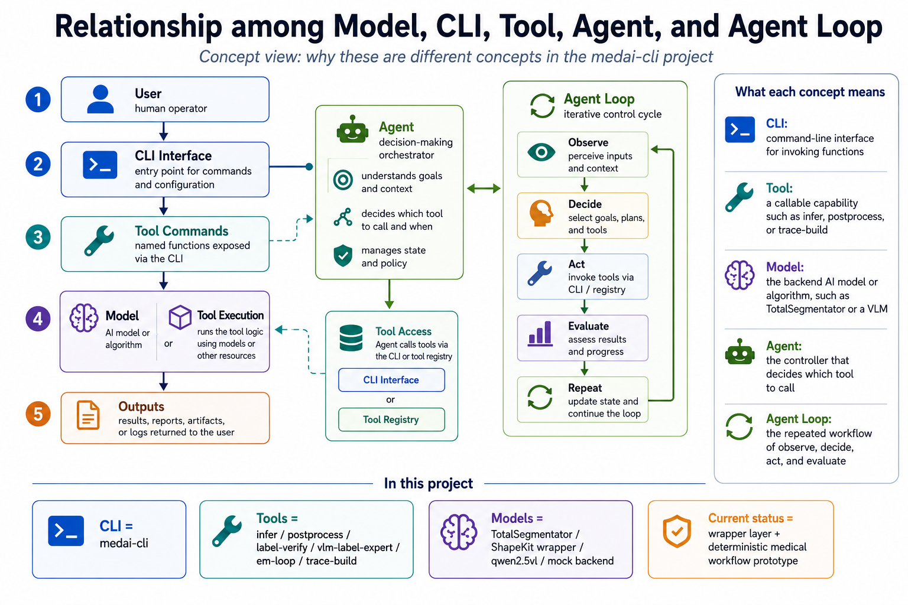
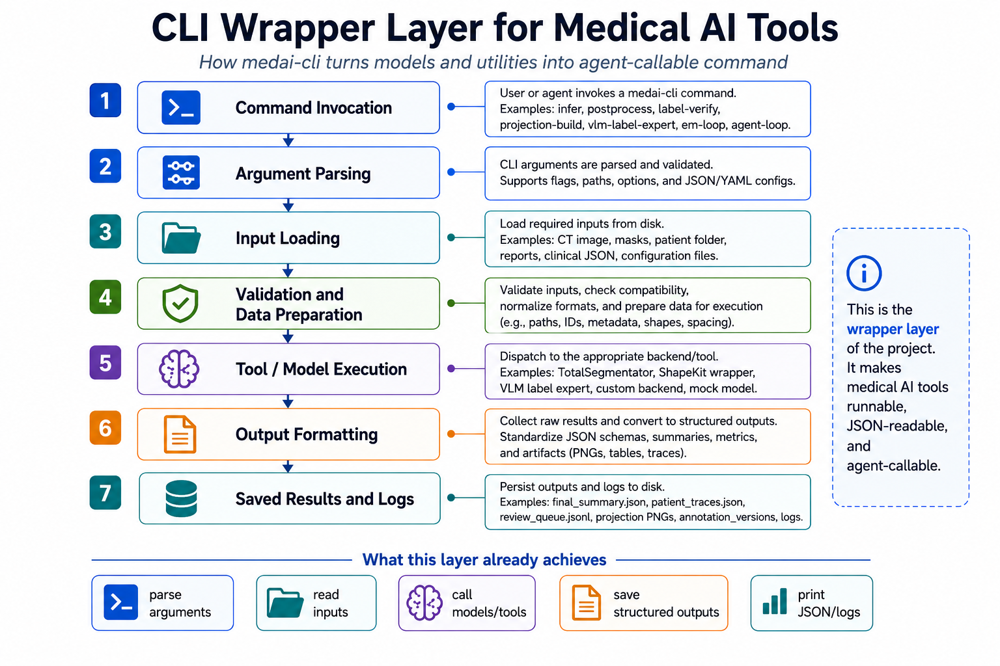
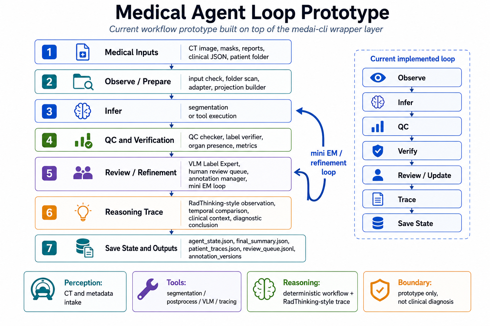

# medai-agent-loop-cli-anything

> **A runnable CLI-based medical AI workflow prototype with tool calling, verification, VLM-assisted review, and structured reasoning.**

`medai-agent-loop-cli-anything` provides a unified `medai-cli` interface for running medical AI models and workflow utilities from the command line. It wraps medical image segmentation, segmentation post-processing, annotation verification, VLM-assisted review, annotation version management, and RadThinking-style trace generation into reproducible CLI commands with structured JSON outputs.

The project focuses on the engineering foundation of a medical agent workflow: making medical models and utilities callable, making intermediate results auditable, and organizing multiple tools into a controlled workflow of observation, inference, quality checking, verification, review/refinement, trace generation, and state saving.

---

## Project Goal

Medical AI workflows often involve separate scripts, model checkpoints, post-processing utilities, manual inspection steps, and evaluation tools. These components are difficult to reuse in an agent workflow unless they expose clear interfaces, predictable parameters, and machine-readable outputs.

This project addresses that problem by building a CLI-centered medical AI workflow prototype:

```text
medical model / utility
→ CLI-callable tool
→ structured JSON output
→ deterministic workflow controller
→ review / refinement / reasoning artifacts
```

The current implementation is built around three principles:

1. **Reproducible execution**  
   Core operations are exposed through `medai-cli` commands and can be invoked with explicit command-line arguments.

2. **Structured outputs**  
   The workflow saves JSON-compatible artifacts such as `final_summary.json`, `agent_state.json`, `patient_traces.json`, and `review_queue.jsonl`.

3. **Controlled workflow composition**  
   Medical tools are connected through a deterministic workflow controller instead of an unrestricted autonomous planner.

---

## Core Contributions

| Component | Current implementation | Role |
|---|---|---|
| `medai-cli` command interface | Implemented | Unified CLI entry point for medical AI tools |
| TotalSegmentator wrapper | Implemented | Real medical image segmentation backend |
| Custom backend interface | Implemented | Allows arbitrary local model commands to be plugged into the workflow |
| ShapeKit wrapper | Implemented | Optional anatomy-aware segmentation post-processing |
| Label Verifier | Implemented | DSC-based comparison between annotation and prediction |
| Projection Builder | Implemented | CT + mask overlay generation for human or VLM review |
| VLM Label Expert | Implemented | Candidate annotation comparison with Ollama `qwen2.5vl:7b` or stub backend |
| AnnotationManager | Implemented | Versioned raw / prediction / updated annotation storage |
| Mini EM loop | Implemented as prototype | Inference → optional post-processing → verification/VLM → annotation update → M-step stub |
| RadThinking-style trace | Implemented | Observation, temporal comparison, clinical context, and conclusion fields |
| Agent-loop controller | Implemented | Observe → infer → QC → verify → review/update → trace → save state |

The repository is not only a single-model wrapper. It contains a CLI wrapper layer, multiple medical tool modules, and a deterministic workflow prototype.

---

## Layered Implementation Design

The implementation separates **backend**, **core workflow logic**, and **CLI interface**.

```text
Backend layer
→ low-level model / software execution

Core layer
→ workflow logic, verification, routing, tracing, state management

CLI layer
→ command-line parameters, user-facing commands, JSON output
```

This separation keeps the system modular. The backend layer handles concrete model or software calls, such as TotalSegmentator, ShapeKit, a custom local model command, or a VLM backend. The core layer implements the medical workflow logic, including QC, label verification, projection generation, annotation versioning, mini EM-style refinement, RadThinking-style trace construction, and state recording. The CLI layer exposes these capabilities through documented commands, handles user parameters, and returns structured outputs.

Because of this design, replacing a model does not require rewriting the entire workflow. A new segmentation model or medical tool can be connected through the backend interface while the same CLI commands, core workflow logic, JSON outputs, and state-management structure remain reusable.

---

## Implementation Details

### Label Verifier

The Label Verifier compares a current annotation with a model prediction using Dice Similarity Coefficient (DSC), then routes the case according to the agreement level.

| Condition | Decision |
|---|---|
| prediction missing | `review_queue` |
| current annotation missing | `auto_replace_candidate` |
| current annotation empty and prediction non-empty | `auto_replace_candidate` |
| both masks non-empty but nearly non-overlapping | `send_to_vlm_label_expert` |
| `0 < DSC < threshold` | `send_to_vlm_label_expert` |
| `DSC ≥ threshold` | `accept` |

The workflow avoids the unsafe shortcut:

```text
DSC = 0 → always replace
```

If both masks are non-empty but completely disjoint, the case is routed to VLM-assisted review or manual review instead of being blindly overwritten.

---

### Projection Builder

The Projection Builder converts a CT image and one or two candidate masks into mask-centered 2D overlay images.

```text
CT image + candidate mask A + candidate mask B
→ axial / coronal / sagittal overlays
→ PNG files for VLM-assisted or manual review
```

It also supports strict alignment checks to detect CT/mask shape mismatch or affine mismatch before creating the visual comparison.

---

### VLM Label Expert

The VLM Label Expert compares two candidate annotations using projection images.

```text
CT image + annotation A + annotation B
→ projection PNGs
→ VLM or stub backend
→ winner / confidence / reason
→ decision log or review routing
```

Example output:

```json
{
  "winner": "A",
  "confidence": 0.80,
  "reason": "Candidate A is more anatomically plausible.",
  "num_projection_images_sent": 2
}
```

The VLM path can run through a local Ollama model such as `qwen2.5vl:7b`, or through a stub backend for dependency-free testing. If the VLM response cannot be parsed safely, the result is marked uncertain and can be routed for review.

---

### Mini EM Annotation-Refinement Loop

The mini EM loop is inspired by iterative annotation refinement workflows.

```text
Round N
→ inference
→ optional ShapeKit post-processing
→ E-step: verifier + optional VLM review
→ annotation update
→ M-step: retraining stub / data-annealing plan
→ metrics saved
```

The current implementation executes inference, verification, VLM/stub routing, annotation versioning, and metrics logging. The M-step records the intended retraining or data-annealing plan but does not train a new model.

---

### RadThinking-style Trace

The trace generator produces structured case-level outputs.

| Field | Meaning |
|---|---|
| `observation` | CT/mask-derived observation fields, such as volume, bounding box, centroid, and intensity summary |
| `temporal_comparison` | comparison with a previous scan when available |
| `clinical_context` | parsed report and clinical JSON information |
| `diagnostic_conclusion` | structured conclusion field derived from provided pathology or follow-up JSON when available |

The trace generator organizes evidence into a structured artifact. It does not make a clinical diagnosis.

---

## System Architecture

The system is explained through three architecture views. They are intentionally separated because they answer different design questions.

### 1. Conceptual Relationship: Model, CLI, Tool, Agent, and Agent Loop



This figure clarifies the conceptual structure of the project.

| Concept | Meaning in this repository |
|---|---|
| **Model** | Backend capability such as TotalSegmentator, a custom segmentation model, a mock backend, or a VLM |
| **Tool** | A callable operation exposed as a `medai-cli` command, such as `infer`, `postprocess`, `label-verify`, `projection-build`, `vlm-label-expert`, `em-loop`, `agent-loop`, or `trace-build` |
| **CLI** | The reproducible interface that exposes tools as documented commands |
| **Agent Controller** | The orchestration layer that sequences tool calls and routes intermediate results |
| **Agent Loop** | The repeated workflow of observing inputs, executing actions, evaluating results, updating state, and saving outputs |

The key distinction is:

```text
Model = backend capability
Tool = callable action exposed as a command
CLI = reproducible interface
Agent Controller = workflow orchestrator
Agent Loop = stateful control process
```

In this repository, tools are concrete `medai-cli` commands. For example, `infer` runs model inference, `postprocess` runs optional ShapeKit post-processing, `label-verify` compares annotations and predictions, `projection-build` creates visual comparison images, `vlm-label-expert` performs VLM-assisted annotation review, `em-loop` executes the mini refinement loop, `agent-loop` runs the patient-level workflow, and `trace-build` generates structured reasoning traces.

---

### 2. CLI Wrapper Layer for Medical AI Tools



This figure shows the engineering layer that makes medical AI components callable and reusable.

```text
command invocation
→ argument parsing
→ input loading
→ validation and data preparation
→ tool / model execution
→ output formatting
→ saved results and logs
```

| Wrapper stage | Implementation |
|---|---|
| Command invocation | `python run_medai_cli.py --json <command> ...` |
| Argument parsing | `click`-based command definitions in `medai_cli.py` |
| Input loading | CT images, masks, reports, patient folders, and JSON metadata |
| Validation / preparation | path checks, folder normalization, organ lists, projection building, and metadata preparation |
| Tool / model execution | TotalSegmentator, ShapeKit wrapper, VLM Label Expert, custom backend, and mock backend |
| Output formatting | JSON serialization, summary generation, trace construction, and state logging |
| Saved artifacts | `final_summary.json`, `agent_state.json`, `patient_traces.json`, `review_queue.jsonl`, projection PNGs, and annotation version folders |

The wrapper layer makes the tools runnable from the terminal, compatible with JSON-based automation, and ready to be called by a later agent controller.

---

### 3. Medical Agent Loop Prototype



This figure shows how the CLI-callable tools are composed into a medical workflow prototype.

```text
Medical inputs
→ observe / prepare
→ infer
→ QC and verification
→ review / refinement
→ reasoning trace
→ save state and outputs
```

The current deterministic loop is:

```text
Observe → Infer → QC → Verify → Review / Update → Trace → Save State
```

| Workflow stage | Implementation | Output |
|---|---|---|
| Medical inputs | CT image, masks, reports, clinical JSON, patient folder | patient/case layout |
| Observe / prepare | patient-folder scan, input checks, adapter, projection builder | normalized inputs and metadata |
| Infer | TotalSegmentator, custom backend, or mock backend | segmentation masks / model outputs |
| QC and verification | QC checker + Label Verifier | organ presence checks, DSC routing, warning/review decisions |
| Review / refinement | VLM Label Expert, review queue, AnnotationManager, mini EM loop | decisions, updated candidates, review items |
| Reasoning trace | RadThinking-style trace builder | `patient_traces.json` |
| Save state | event logging and final summaries | `agent_state.json`, `final_summary.json`, `review_queue.jsonl` |

At the workflow level, the agent loop starts from the patient folder, observes the available scans and metadata, calls inference, performs QC, runs label verification, routes uncertain cases to VLM-assisted or manual review, generates RadThinking-style traces, and finally saves the state and summary artifacts. The workflow is intentionally deterministic and auditable. Optional VLM review is used as a bounded comparison module, not as a free-form clinical decision maker.

---

## Design Lineage

The project combines ideas from multiple systems and papers, but it does not redistribute external source repositories, private datasets, or paper PDFs.

| Source / idea | Key concept | How it appears in this project |
|---|---|---|
| CLI-Anything-style design | Expose software capabilities as CLI-callable tools | `medai-cli`, JSON output mode, `SKILL.md`, documented commands, structured outputs |
| ScaleMAI-style refinement | Iterative annotation verification and refinement | Label Verifier, VLM Label Expert, AnnotationManager, mini EM loop |
| ShapeKit-style post-processing | Anatomy-aware segmentation post-processing | optional `postprocess` command and `shapekit_runner.py` |
| PanTS-style setting | Pancreatic CT segmentation / evaluation background | PanTS import/check/eval helpers and batch scripts |
| RadThinking-style reasoning | Structured longitudinal reasoning trace | observation, temporal comparison, clinical context, and conclusion fields |

---

## Repository Structure

```text
medai-agent-loop-cli-anything/
├── README.md
├── QUICKSTART_WINDOWS.md
├── run_medai_cli.py
├── run_medai_cli.bat
├── assets/
├── agent-harness/
│   ├── setup.py
│   ├── requirements*.txt
│   ├── cli_anything/
│   │   └── medai/
│   │       ├── medai_cli.py
│   │       ├── skills/SKILL.md
│   │       └── core/
│   │           ├── agent_controller.py
│   │           ├── agent_state.py
│   │           ├── totalseg_runner.py
│   │           ├── shapekit_runner.py
│   │           ├── adapter.py
│   │           ├── label_verifier.py
│   │           ├── projection_builder.py
│   │           ├── vlm_label_expert.py
│   │           ├── annotation_manager.py
│   │           ├── em_loop.py
│   │           ├── radthinking.py
│   │           ├── qc_checker.py
│   │           ├── human_review.py
│   │           └── pants_utils.py
│   └── tests/
├── docs/
├── scripts/
├── examples/
└── third_party/
    └── mock_model/
```

---

## Installation

### Minimal installation

The minimal setup is enough for the self-contained workflow demo. It does not require PanTS, ShapeKit, TotalSegmentator, Ollama, GPU, or private medical data.

```powershell
conda create -n medai-agent python=3.10 -y
conda activate medai-agent
cd D:\Desktop\medai_agent_loop_cli_anything_final

pip install -r agent-harness\requirements.txt
pip install -e agent-harness

python run_medai_cli.py --json doctor
```

### Optional TotalSegmentator backend

TotalSegmentator is supported as a real medical image segmentation backend.

```powershell
pip install -r agent-harness\requirements-totalseg.txt
```

After installation, `infer`, `run`, `agent-loop`, and `em-loop` can use the TotalSegmentator backend through `--backend totalseg`.

### Optional VLM backend

The VLM Label Expert can use Ollama with `qwen2.5vl:7b`.

```powershell
ollama pull qwen2.5vl:7b
```

If Ollama is not available, VLM-related commands can still be exercised with the `stub` backend.

### Development tests

```powershell
pip install -r agent-harness\requirements-dev.txt
cd agent-harness
python -m pytest tests/ -v
cd ..
```

Validation notes are documented in:

```text
docs/VALIDATION_REPORT.md
docs/VALIDATION_RUN_2026-05-10.md
```

---

## Workflow Demo

This section provides a reproducible Windows PowerShell demo for the CLI workflow. It uses synthetic patient data and the included lightweight mock backend, so it can run without private medical data, GPU, TotalSegmentator, ShapeKit, or Ollama. The same CLI interface also supports real TotalSegmentator inference, VLM-assisted review, ShapeKit post-processing, PanTS utilities, and mini EM-style refinement when those dependencies or datasets are available.

### Primary end-to-end workflow

Copy and run the following commands in PowerShell.

```powershell
cd D:\Desktop\medai_agent_loop_cli_anything_final
```

```powershell
python run_medai_cli.py --help
```

```powershell
python run_medai_cli.py --json doctor
```

```powershell
Remove-Item -Recurse -Force data\radthinking_demo -ErrorAction SilentlyContinue
Remove-Item -Recurse -Force outputs\meeting_demo -ErrorAction SilentlyContinue
Remove-Item -Recurse -Force outputs\vlm_stub_demo -ErrorAction SilentlyContinue
Remove-Item -Recurse -Force outputs\em_loop_demo -ErrorAction SilentlyContinue
Remove-Item -Recurse -Force outputs\totalseg_demo -ErrorAction SilentlyContinue
```

```powershell
python scripts\create_radthinking_demo.py
```

```powershell
python run_medai_cli.py --json radthinking-check `
  --patient-folder data\radthinking_demo\patient_001
```

```powershell
python run_medai_cli.py --json agent-loop `
  --patient-folder data\radthinking_demo\patient_001 `
  --output-folder outputs\meeting_demo `
  --backend custom `
  --model-command "python third_party\mock_model\mock_seg_infer.py --image {image} --output {output}" `
  --postprocess none `
  --organ liver `
  --expected-organs liver
```

The workflow writes its outputs to:

```text
outputs/meeting_demo/
├── agent_state.json
├── final_summary.json
├── patient_traces.json
├── review_queue.jsonl
└── scan_outputs/
```

### Inspect generated outputs

The following commands print the most important output files directly in the terminal.

```powershell
Get-ChildItem outputs\meeting_demo
```

```powershell
Get-Content outputs\meeting_demo\final_summary.json
```

```powershell
Get-Content outputs\meeting_demo\agent_state.json
```

```powershell
Get-Content outputs\meeting_demo\patient_traces.json
```

```powershell
Get-Content outputs\meeting_demo\review_queue.jsonl
```

```powershell
Get-ChildItem outputs\meeting_demo\scan_outputs -Recurse
```

| Output | Meaning |
|---|---|
| `final_summary.json` | Run-level summary containing status, implemented steps, scan results, review items, and output paths |
| `agent_state.json` | Event-level workflow trace recording observation, inference, QC, decision, trace, and save-state events |
| `patient_traces.json` | RadThinking-style structured traces with observation, temporal comparison, clinical context, and conclusion fields |
| `review_queue.jsonl` | Review queue for uncertain, failed, or safety-sensitive cases |
| `scan_outputs/` | Per-scan backend outputs, including generated prediction folders and command logs |

### Optional VLM Label Expert interface

This command exercises the VLM Label Expert interface with the dependency-free `stub` backend. It uses two synthetic masks from different time points to trigger projection generation and structured review output.

```powershell
python run_medai_cli.py --json vlm-label-expert `
  --ct-image data\radthinking_demo\patient_001\scans\2013-10\ct.nii.gz `
  --annotation-a data\radthinking_demo\patient_001\demo_masks\2013-07\liver.nii.gz `
  --annotation-b data\radthinking_demo\patient_001\demo_masks\2013-10\liver.nii.gz `
  --organ liver `
  --output-folder outputs\vlm_stub_demo `
  --vlm-backend stub
```

Inspect the VLM Label Expert output:

```powershell
Get-ChildItem outputs\vlm_stub_demo -Recurse
```

If a local Ollama VLM is available, the same command can be run with:

```powershell
python run_medai_cli.py --json vlm-label-expert `
  --ct-image data\radthinking_demo\patient_001\scans\2013-10\ct.nii.gz `
  --annotation-a data\radthinking_demo\patient_001\demo_masks\2013-07\liver.nii.gz `
  --annotation-b data\radthinking_demo\patient_001\demo_masks\2013-10\liver.nii.gz `
  --organ liver `
  --output-folder outputs\vlm_ollama_demo `
  --vlm-backend ollama `
  --vlm-model qwen2.5vl:7b
```

### Optional mini EM loop dry run

This command exercises the mini EM-loop interface without running full model training.

```powershell
python run_medai_cli.py --json em-loop `
  --case-id demo_case `
  --ct-image data\radthinking_demo\patient_001\scans\2013-10\ct.nii.gz `
  --annotation-folder data\radthinking_demo\patient_001\demo_masks\2013-10 `
  --output-folder outputs\em_loop_demo `
  --organs liver `
  --vlm-backend stub `
  --postprocess none `
  --dry-run
```

Inspect the EM-loop output:

```powershell
Get-ChildItem outputs\em_loop_demo -Recurse
```

```powershell
Get-Content outputs\em_loop_demo\rounds_metrics.json
```

### Optional TotalSegmentator inference

This command uses the real TotalSegmentator backend. Run it only after installing the optional TotalSegmentator requirements.

```powershell
python scripts\create_demo_ct.py
```

```powershell
python run_medai_cli.py --json infer `
  --image data\single_case\case_001\ct.nii.gz `
  --output-folder outputs\totalseg_demo `
  --backend totalseg `
  --fast
```

Inspect the TotalSegmentator output:

```powershell
Get-ChildItem outputs\totalseg_demo -Recurse
```

---

## Main CLI Commands

Typical command form:

```powershell
python run_medai_cli.py --json <command> ...
```

### Environment and layout utilities

| Command | Purpose |
|---|---|
| `doctor` | Check Python environment, optional backend paths, and project configuration |
| `presets` | Show ROI presets and expected organs used by TotalSegmentator/ShapeKit-style workflows |
| `check-image` | Validate a CT image path |
| `check-folder` | Validate an input case or segmentation folder |
| `summary` | Summarize a segmentation folder |

### Inference and post-processing

| Command | Purpose |
|---|---|
| `infer` | Run TotalSegmentator or a custom local model command and save segmentation outputs |
| `adapt` | Normalize a segmentation folder into the naming/layout expected by the workflow |
| `postprocess` | Run ShapeKit post-processing when ShapeKit is installed locally |
| `run` | Run one image through inference, adapter, optional ShapeKit post-processing, and summary generation |

### RadThinking-style reasoning

| Command | Purpose |
|---|---|
| `radthinking-check` | Validate the synthetic or imported patient-folder layout |
| `radthinking-run-patient` | Run per-scan inference and optional post-processing over a patient folder |
| `trace-template` | Create a trace template for a case |
| `trace-observation` | Extract mask/CT-based observation features |
| `trace-temporal` | Compare previous and current masks to generate temporal labels |
| `trace-context` | Parse report and clinical metadata into structured context |
| `trace-build` | Build one RadThinking-style structured trace |
| `trace-patient` | Build patient-level traces from workflow outputs |

### Verification, VLM review, and refinement

| Command | Purpose |
|---|---|
| `label-verify` | Compare current annotations with model predictions using DSC and route cases to accept, VLM review, or manual review |
| `projection-build` | Generate CT + mask overlay PNGs for manual or VLM-assisted review |
| `vlm-label-expert` | Compare candidate annotations using projection images and a VLM or stub backend |
| `em-loop` | Run a mini annotation-refinement loop: inference, optional ShapeKit, verification/VLM review, annotation update, and M-step stub |
| `agent-loop` | Run the patient-level deterministic workflow controller: observe, infer, QC, verify, review/update, trace, save state |

### PanTS utilities

| Command | Purpose |
|---|---|
| `pants-info` | Show PanTS download and layout information |
| `pants-check` | Check whether a local PanTS directory is available and recognizable |
| `pants-find-case` | Locate a specific downloaded PanTS case |
| `pants-import-case` | Import one downloaded PanTS case into the project’s patient-folder layout |
| `pants-import-files` | Import a PanTS-like CT case from local image/label/report paths |
| `pants-eval-case` | Compute binary Dice scores between predicted masks and reference labels for selected organs |

---

## Output Artifacts

| Output | Meaning |
|---|---|
| `final_summary.json` | Final run-level summary, including status, implemented steps, scan results, review items, and output paths |
| `agent_state.json` | Auditable event log for the workflow; records each step, status, action result, and final summary |
| `patient_traces.json` | RadThinking-style structured traces for patient scans |
| `review_queue.jsonl` | Review queue for uncertain, failed, or safety-sensitive cases |
| `scan_outputs/` | Per-scan output directory containing raw predictions, optional refined predictions, logs, and refinement artifacts |
| `annotation_versions/` | Versioned annotation storage used during agent-loop refinement: raw, predictions, updated labels, and decisions |
| `annotations/` | Versioned annotation storage used by the standalone `em-loop` command |
| `rounds_metrics.json` | Per-round EM-loop metrics, decisions, annotation summaries, and M-step stub information |
| projection PNGs | CT + mask overlay images used for VLM-assisted or manual annotation comparison |

Static sample outputs are provided in:

```text
examples/sample_outputs/
```

---

## Validation Status

The repository includes tests for key modules:

```text
Label Verifier routing
AnnotationManager versioning
VLM response parsing
Projection Builder
RadThinking trace parsing
QC checks
EM loop dry-run
package import checks
```

Recorded validation notes are available in:

```text
docs/VALIDATION_REPORT.md
docs/VALIDATION_RUN_2026-05-10.md
```

---

## Data and Dependency Notes

This repository intentionally excludes:

```text
real CT data
real PanTS data
runtime outputs
ShapeKit source code
PanTS source repository
private or unpublished research materials
paper PDFs
model weights
API keys / tokens / secrets
```

Reasons:

```text
avoid uploading medical or derived data
avoid third-party copyright/license risks
avoid redistributing private or unpublished materials
keep the repository lightweight and reproducible
```

See also:

```text
UPLOAD_MANIFEST.md
PACKAGE_NOTES.md
third_party/README.md
```

---

## Summary

`medai-agent-loop-cli-anything` demonstrates a CLI-based medical AI workflow prototype with:

```text
real TotalSegmentator wrapper
+ custom model backend
+ optional ShapeKit post-processing
+ Label Verifier
+ Projection Builder
+ VLM Label Expert
+ AnnotationManager
+ mini EM-style refinement
+ RadThinking-style structured traces
+ deterministic workflow controller
+ auditable JSON outputs
```

The repository is structured for reproducible demonstration, code review, and future extension into larger medical AI agent systems.
