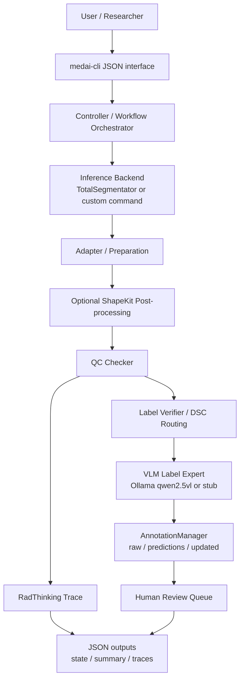
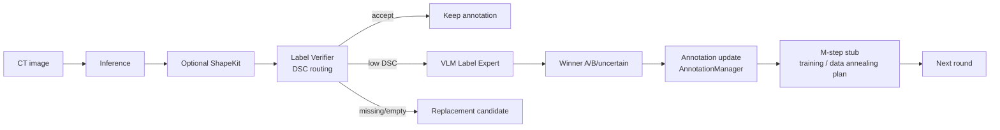
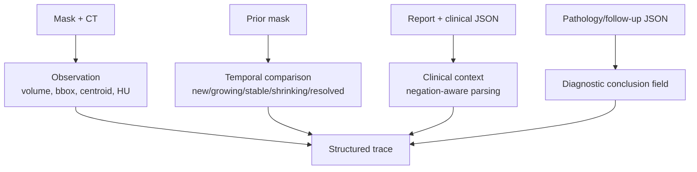

# Figures

This repository includes PNG figures for README display and Mermaid diagrams for text-based rendering.

## Why there are three main README figures

The three README figures are intentionally different. They answer three different questions:

1. **Concept relationship** — what is the difference among model, CLI, tool, agent, and agent loop?
2. **Wrapper layer** — what was actually implemented as the current-stage engineering artifact?
3. **Workflow prototype** — how does the wrapper layer become a medical workflow / future agent-loop prototype?

## README figures

### Figure 1 — Relationship among Model, CLI, Tool, Agent, and Agent Loop

### Figure 2 — CLI Wrapper Layer for Medical AI Tools

### Figure 3 — Medical Agent Loop Prototype

## Mermaid diagrams

### Overall workflow prototype

### ScaleMAI-inspired mini EM loop

### RadThinking-style trace

